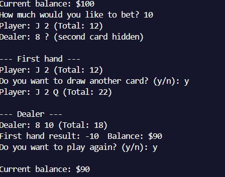

# Blackjack su console in C++

## Come eseguire
1. compila: 'g++ Blackjack.cpp -o Blackjack'
2. esegui: './Blackjack o Blackjack.exe'

## Regole
- Carte da 1 a 10 (J, Q, K = 10)
- Asso vale 1 o 11 automaticamente
- Dealer pesca fino a 17

## Screenshot di gioco
 

Progetto scolastico per esercitarmi con C++