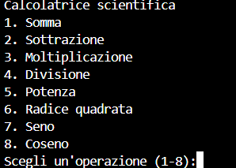

# Calcolatrice scientifica in C++

## Come eseguire
1. compila: 'g++ CalcolatriceScientifica.cpp -o Calcolatrice'
2. esegui: './Calcolatrice o Calcolatrice.exe'

### Screenshot terminale

Progetto scolastico per esercitarmi con C++